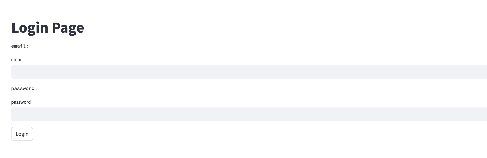

# SAKAMOMO FAMILY SERVICE FRONTEND

サービスのフロントエンド部分（Webフロントなど）のコードをまとめています

## セットアップ

### 環境変数の設定

.envファイルを作成し、下記の内容を記載してください.<br>

```
GOOGLE_CLOUD_PROJECT=xx
```

各定数の詳細については下記に記載します.
| 定数名 | 概要 |
| ---- | ---- |
| GOOGLE_CLOUD_PROJECT | |

### シークレット変数の設定

secretフォルダを作成し、下記のjsonファイルを作成してください.

* secret/config.json

Identity Platformを用いて、認証処理を行う際に必要な情報となります.
```json
{
  "apiKey": "xx",
  "authDomain": "xx",
  "databaseURL": "",  // 空のままでOK
  "storageBucket": "" // 空のままでOK
}
```

* secret/iap_config.json

Identity Aware Proxyを利用して、バックエンドAPI（CloudRun）が保護されている場合、下記の情報を使って、フロントエンド側からバックエンド側にIAPを通して、アクセスが可能となります.

```json
{
  "CLIENT_ID": "xx",
  "CLIENT_SECRET": "xx",
  "BACKEND_URL": "xx"
}
```

### 環境のセットアップ

描きコマンドを実行して、gcrへのpushするためのセットアップを行います.

```bash
$ make setup
```

## ビルド

下記のコマンドを実行して、docker imageを構築し、gcrへプッシュします.

```bash
$ make build
$ make push_image
```

## デプロイ

下記のコマンドを実行して、cloudrunにgcrにpushしたdocker imageをデプロイします.

```bash
$ make deploy_run
```

## Webページにアクセス

デプロイ先となるCloudRunのurlをgoogle cloud consoleから確認し、urlをブラウザにペーストしてアクセスする.<br>
下記のようなログイン画面が表示される.


